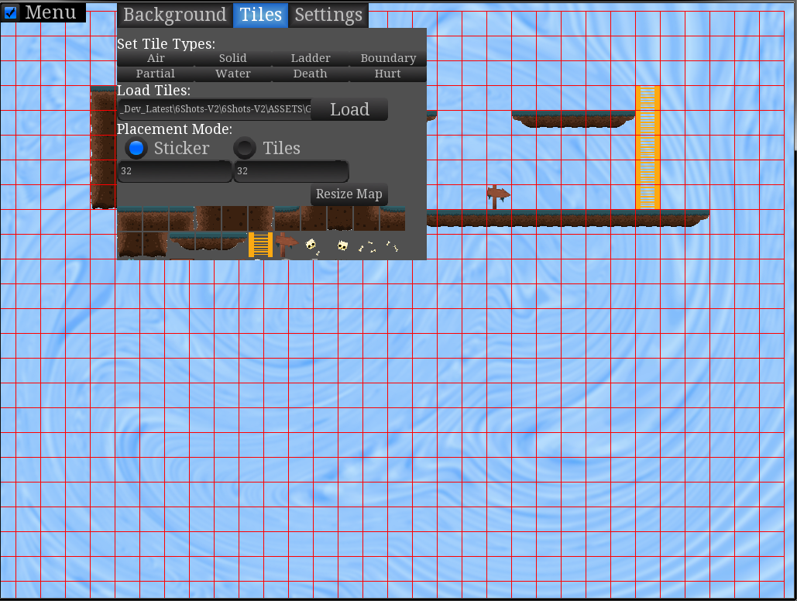
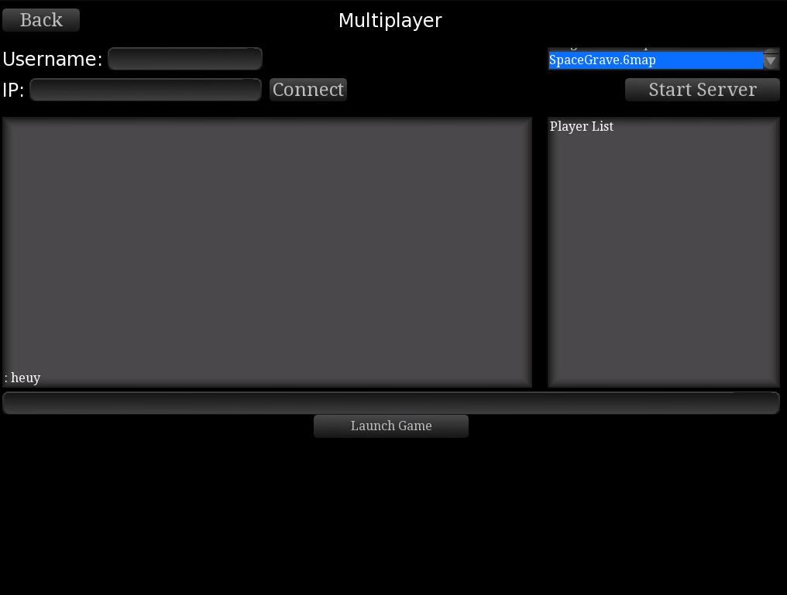
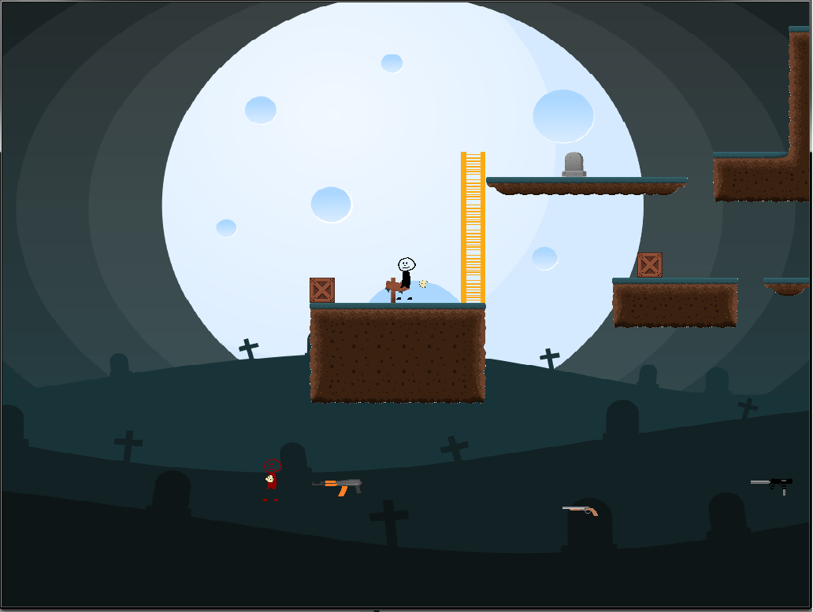

# 6Shots
Multiplayer platformer twitch-shooter

## Assets:
### Images:
  - Tileset is from https://www.gameart2d.com/free-graveyard-platformer-tileset.html under CC0  licence
  - Other images are drawn by me
### Sound
  - Firearms sounds are from The Free Firearm Sound Library (website now defunct)
### Font
  - Font is Deja Vu Sans ( https://dejavu-fonts.github.io/ ) 
  
  
# Dependencies
- C++11
- Box2D
- LUA v5.3
- SFML
- TGUI for SFML + example widgetset
- boost
- rapidxml

# Building / Running
visual c++ for now

# Screenshots

